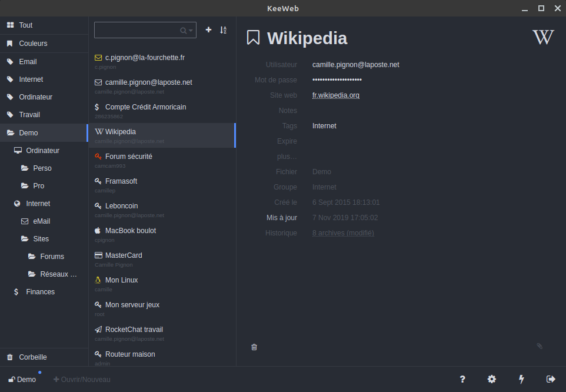

KeeWeb ([keeweb.info](https://keeweb.info)) est un logiciel de gestion de mots de passe gratuit et [libre](https://fr.wikipedia.org/wiki/Logiciel_libre). Le site Web est en anglais, mais le logiciel peut être configuré pour être en français, en anglais ou en allemand.

En plus des caractéristiques ci-dessus, j'ai choisi KeeWeb en raison de sa simplicité d'utilisation et de la possibilité de l'installer aussi bien sous Windows, Mac ou Linux (paquet DEB).

Enfin, il utilise le format de fichier kdbx, qui, avec la popularité du logiciel [KeePass](https://keepass.info/), est devenu un format supporté par de nombreux logiciels de gestion de mots de passse. Utiliser un logiciel supportant ce format, comme KeeWeb, vous permet de migrer facilement vos mots de passe vers un autre logiciel si vous souhaitez en changer.

KeeWeb peut s'utiliser comme programme installé sur votre ordinateur ou en ouvrant votre fichier de mots de passe sur [app.keeweb.info](https://app.keeweb.info). Ainsi, même si vous utilisez un autre ordinateur que le vôtre, que KeeWeb n'est pas installé et que vous avez votre fichier de mots de passe avec vous (par exemple sur une clé USB), vous pouvez consulter vos mots de passe sur [app.keeweb.info](https://app.keeweb.info).

Ce guide s'appuie sur la [version 1.12.3](https://github.com/keeweb/keeweb/releases/tag/v1.12.3) de KeeWeb.

> Dernière mise à jour de cette section : {docsify-updated}
