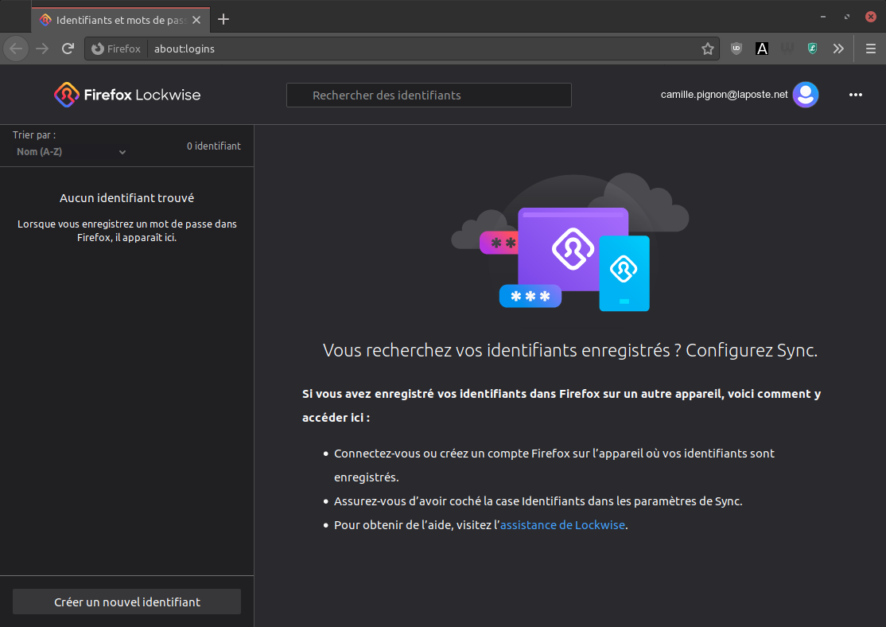

Firefox ([mozilla.org](https://www.mozilla.org/fr/firefox/new/)) est un navigateur Web développé par la fondation Mozilla. C'est le navigateur recommandé dans ce guide car il est à la fois [libre](https://fr.wikipedia.org/wiki/Logiciel_libre) et respectueux de la vie privée.

Aujourd'hui, tous les navigateurs Web proposent de sauvegarder vos mots de passe et de les remplir automatiquement dans les formulaires de connexion. Nous allons donc voir comment associer KeeWeb et Firefox pour simplifier votre navigation Web.

## Le compte Firefox

Afin de vous permettre de synchroniser vos mots de passe et vos préférences entre vos différents appareils, Firefox propose Firefox Sync, un compte en ligne sur lequel vous pouvez sauvegarder vos mots de passe ainsi que d'autres informations. Ainsi, que vous utilisiez Firefox sur votre ordinateur ou votre téléphone, vous avez toujours accès à vos mots de passe.

Lorsque vous utilisez Firefox Sync, à aucun moment Mozilla ne peut lire vos mots de passe car ils sont chiffrés sur votre ordinateur avec votre mot de passe maître avant d'être envoyés sur les serveurs de Mozilla.

Première étape : [créer votre compte et configurer Firefox](fr/firefox-configuring.md).

> Dernière mise à jour de cette section : {docsify-updated}
